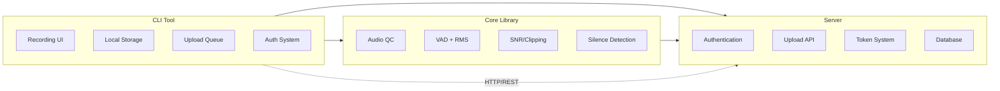

# CowCow 🎙️

**CowCow is an offline-first, intelligent speech data collection toolkit for low-resource languages**

I call it **Cowcow** because I think its just a cool name. But if youtake life seriously, you can consider it to mean "Capture Our Words/Capture Our World". CowCow is a command-line toolkit built with Rust for collecting high-quality speech data with intelligent recording features, real-time quality control, and seamless cloud synchronization even in low-connectivity situations.

## Key Features

- **Intelligent Recording**: Auto-stop after 5 seconds of silence with voice activity reset
- **Real-time Quality Control**: Live SNR, clipping detection, and voice activity monitoring  
- **Offline-first**: Record locally, sync when connectivity available with resumable uploads
- **Authentication**: Secure JWT + API key authentication system
- **Cross-platform**: Rust-powered CLI for maximum performance and reliability
- **REST + gRPC APIs**: Modern backend with FastAPI and protocol buffers

## Quick Start

### Prerequisites

- **Rust** (1.70+): [Install Rust](https://rustup.rs/)
- **Python** (3.8+): [Install Python](https://python.org)
- **Audio Input**: Working microphone

## 📚 Documentation

For detailed guides and comprehensive information:

- **[Setup Guide](docs/SETUP.md)**: Complete step-by-step installation and setup
- **[Testing Guide](docs/TESTING.md)**: Comprehensive testing examples and verification
- **[Configuration Guide](docs/configuration.md)**: Detailed configuration reference
- **[Architecture Guide](docs/architecture.md)**: System design and components

### 1. Installation

**Option A: Automated Build (Recommended)**
```bash
# Clone the repository
git clone https://github.com/thabhelo/cowcow.git
cd cowcow

# Run the automated build script (handles everything!)
./scripts/build.sh

# Test your installation
./scripts/test.sh
```

**Option B: Manual Build**
```bash
# Build the CLI tool
cargo build --release

# The CLI binary is now at: ./target/release/cowcow_cli
```

### 2. Start the Server

```bash
# Navigate to server directory
cd server

# Install Python dependencies
pip install -r requirements.txt

# Start the server (uses SQLite by default)
uvicorn main:app --reload --host 0.0.0.0 --port 8000
```

### 3. Register & Start Recording

```bash
# Register a new account
./target/release/cowcow_cli auth register

# Login
./target/release/cowcow_cli auth login

# Start recording (auto-stops after 5s of silence)
./target/release/cowcow_cli record --lang en

# Record with specific duration
./target/release/cowcow_cli record --lang sw --duration 10

# Upload recordings to server
./target/release/cowcow_cli upload

# Check your stats
./target/release/cowcow_cli stats
```

## Recording Modes

### Intelligent Silence Detection (Default)

```bash
# Auto-stops after 5 seconds of silence
./target/release/cowcow_cli record --lang en

# Speak when ready → pauses reset the silence timer → stops automatically
```

**How it works:**
- Starts silence timer when no voice activity detected
- Resets timer when voice activity resumes  
- Auto-stops after 5 continuous seconds of silence
- Uses both VAD and RMS-based voice detection

### Fixed Duration Recording

```bash
# Record for exactly 30 seconds
./target/release/cowcow_cli record --lang fr --duration 30

# With prompt text
./target/release/cowcow_cli record --lang sw --duration 15 --prompt "Habari za asubuhi"
```

### Multi-language Support

```bash
# Supported language codes
./target/release/cowcow_cli record --lang en    # English
./target/release/cowcow_cli record --lang sw    # Swahili  
./target/release/cowcow_cli record --lang fr    # French
./target/release/cowcow_cli record --lang zu    # Zulu
./target/release/cowcow_cli record --lang xh    # Xhosa
# ... any ISO language code
```

## Quality Control Metrics

Real-time monitoring during recording:

```
🎙️  RECORDING NOW!
⠁ Recording... SNR: 24.4 dB | Clipping: 0.0% | VAD: 0.0% | RMS: 0.0023 | Silence: 2.3s
```

- **SNR**: Signal-to-Noise Ratio (higher is better)
- **Clipping**: Percentage of clipped samples (lower is better)  
- **VAD**: Voice Activity Detection percentage
- **RMS**: Root Mean Square audio level
- **Silence**: Current silence duration (resets when voice detected)

### Quality Thresholds (configurable in `~/.cowcow/config.toml`)

```toml
[audio]
min_snr_db = 20.0        # Minimum SNR for upload
max_clipping_pct = 1.0   # Maximum clipping percentage  
min_vad_ratio = 80.0     # Minimum voice activity ratio
```

## Configuration

Configuration is stored in `~/.cowcow/config.toml`:

```toml
[api]
endpoint = "http://localhost:8000"
timeout_secs = 30

[storage]  
data_dir = "/Users/username/.cowcow"
auto_upload = false

[audio]
sample_rate = 48000
channels = 1
min_snr_db = 20.0
max_clipping_pct = 1.0
min_vad_ratio = 80.0

[upload]
max_retries = 3
retry_delay_secs = 2
chunk_size = 1048576
```

## CLI Commands

### Automation Scripts
```bash
# Build everything automatically
./scripts/build.sh              # Builds CLI, server, checks prerequisites

# Test your installation
./scripts/test.sh               # Verifies everything is working correctly
```

### Recording
```bash
# Basic recording (auto-stops after 5s silence)
./target/release/cowcow_cli record --lang en

# Record with time limit
./target/release/cowcow_cli record --lang sw --duration 30

# Record with prompt text (guides what to say)
./target/release/cowcow_cli record --lang fr --prompt "Bonjour, comment allez-vous?"

# Combined: 15 seconds max with prompt
./target/release/cowcow_cli record --lang zu --duration 15 --prompt "Sawubona, unjani?"
```

### Authentication  
```bash
./target/release/cowcow_cli auth register  # Create new account (username, email, password)
./target/release/cowcow_cli auth login     # Login with credentials (required for uploads)
./target/release/cowcow_cli auth logout    # Clear stored credentials
./target/release/cowcow_cli auth status    # Check if logged in and token expiry
```

### Upload & Sync
```bash
# Upload only recordings that pass quality control
./target/release/cowcow_cli upload

# Upload ALL recordings regardless of quality (low SNR, clipping, etc.)
./target/release/cowcow_cli upload --force

# Note: Requires authentication first (cowcow_cli auth login)
```

### Monitoring
```bash
# Show recording statistics (total, uploaded, pending)
./target/release/cowcow_cli stats
# Output: "Total recordings: 15, Uploaded: 12, Pending: 3"

# System health check (audio, storage, server connection, auth)
./target/release/cowcow_cli doctor
# Shows ✅ or ❌ for each component
```

### Configuration
```bash
# Show current configuration file contents
./target/release/cowcow_cli config show

# Change server endpoint
./target/release/cowcow_cli config set api.endpoint http://example.com

# Reset to default settings
./target/release/cowcow_cli config reset
```

## Architecture



## Development

### Project Structure
```
cowcow/
├── cowcow_cli/          # CLI application (Rust)
├── cowcow_core/         # Audio processing library (Rust)  
├── server/              # Backend API (Python/FastAPI)
├── docs/                # Documentation
└── proto/               # Protocol buffer definitions
```

### Running Tests
```bash
# Rust tests
cargo test

# Start development server
cd server
uvicorn main:app --reload

# Test end-to-end workflow
./target/release/cowcow_cli doctor
```

### API Documentation

When server is running, visit:
- **REST API**: http://localhost:8000/docs (Swagger UI)
- **Health Check**: http://localhost:8000/health

## Production Deployment

### Server Environment Variables

Create `server/.env`:

```bash
# Required
JWT_SECRET=your-secure-jwt-secret-key
DATABASE_URL=sqlite:///./cowcow_server.db

# Optional - Cloudfare R2 Storage  
R2_ACCESS_KEY=your-r2-access-key
R2_SECRET_KEY=your-r2-secret-key
R2_ENDPOINT=https://your-account.r2.cloudflarestorage.com
R2_BUCKET=cowcow-recordings
```

### Performance Targets ✅

- **Audio Processing**: < 200ms per chunk
- **Storage Efficiency**: < 160kB per 10s recording (16kHz mono)
- **Network**: Resumable chunked uploads
- **Offline-first**: Works without internet

## 🤝 Contributing

1. Fork the repository
2. Create your feature branch (`git checkout -b feature/amazing-feature`)
3. Commit your changes (`git commit -m 'Add amazing feature'`)
4. Push to the branch (`git push origin feature/amazing-feature`)
5. Open a Pull Request

### Development Rules

- **Rust**: Follow rustfmt defaults, clippy pedantic
- **Python**: Black + isort, max line length 88
- **Testing**: Unit tests for Rust, integration tests for APIs
- **Documentation**: Update docs for all new features
---
### Future Features & Contribution Opportunities

We welcome contributors to work on these exciting upcoming features:

#### **📱 Mobile Applications**
- **Flutter Mobile App**: Cross-platform mobile recording app
  - Offline-first recording with sync
  - Native UI for iOS/Android
  - Integration with existing server API
  - Mobile-specific QC optimizations

#### **🎛️ CLI Enhancements**
- **Token System UI**: Display rewards and balances in CLI
  - `cowcow_cli tokens balance` - Show current token balance
  - `cowcow_cli tokens history` - Display earning history
  - Post-upload token display and celebrations
- **Configuration Management**: `cowcow_cli config set` command
  - Interactive configuration wizard
  - Validation and error handling
  - Remote configuration sync
- **Export Functionality**: `cowcow_cli export` command
  - Multiple format support (CSV, JSON, WAV bundles)
  - Filtering and search capabilities
  - Batch export operations

#### **Audio Processing**
- **Advanced QC Metrics**: Additional quality control algorithms
  - Emotion detection
  - Language identification
  - Speaker diarization
  - Pronunciation analysis
- **Plugin System**: Extensible QC metric framework
  - Custom metric development
  - Third-party algorithm integration
  - Performance benchmarking tools

#### **Platform Integrations**
- **Cloud Storage Providers**: Beyond Cloudflare R2
  - AWS S3, Google Cloud Storage
  - Azure Blob Storage
  - Local NAS/MinIO support
- **Authentication Providers**: OAuth integration
  - Google, GitHub, Microsoft login
  - SAML/LDAP enterprise support
  - Multi-factor authentication

#### **Analytics & Insights**
- **Dashboard Web UI**: Real-time monitoring interface
  - Recording statistics and trends
  - User activity visualization
  - Quality metrics analytics
- **Reporting System**: Automated insights generation
  - Daily/weekly summary reports
  - Data collection progress tracking
  - Performance optimization suggestions
  
#### **Performance & Scaling**
- **Distributed Processing**: Scalable audio processing
  - Microservices architecture
  - Container orchestration
  - Auto-scaling capabilities
- **Edge Computing**: Reduce latency for remote users
  - CDN integration
  - Edge processing nodes
  - Offline-first optimizations

### Getting Started with Contributions

**For Beginners:**
- Start with CLI enhancements (config set, token display)
- Improve documentation and examples
- Add unit tests for existing functionality

**For Mobile Developers:**
- Flutter app development using existing API
- Mobile-specific UX/UI improvements
- Native platform integrations

**For Audio/ML Engineers:**
- Advanced QC metric development
- Performance optimization
- Algorithm research and implementation

**For Backend Developers:**
- Server scalability improvements
- API enhancements
- Database optimization

**For Frontend Developers:**
- Web dashboard development
- Admin interface creation
- Data visualization components

### Contribution Guidelines

1. **Check Issues**: Look for "good first issue" or "help wanted" labels, if any
2. **Discuss First**: Open an issue to discuss major features before coding
3. **Follow Standards**: Adhere to project coding standards and testing requirements
4. **Document Changes**: Update docs and add examples for new features
5. **Test Thoroughly**: Ensure all tests pass and add new tests for your features

**Questions?** Open an issue or join our discussions to connect with maintainers and contributors!

## ⚡ Performance Notes

- Built with **Rust** for maximum performance and safety
- **Zero-copy** audio processing where possible
- **SQLite** for local storage (PostgreSQL for production)
- **Protocol Buffers** for efficient data serialization
- **Async/await** throughout for optimal resource usage

## 📄 License

Apache-2.0

---

**Built with ❤️ by [Thabhelo](https://github.com/thabhelo) for the Open Source Community** 
