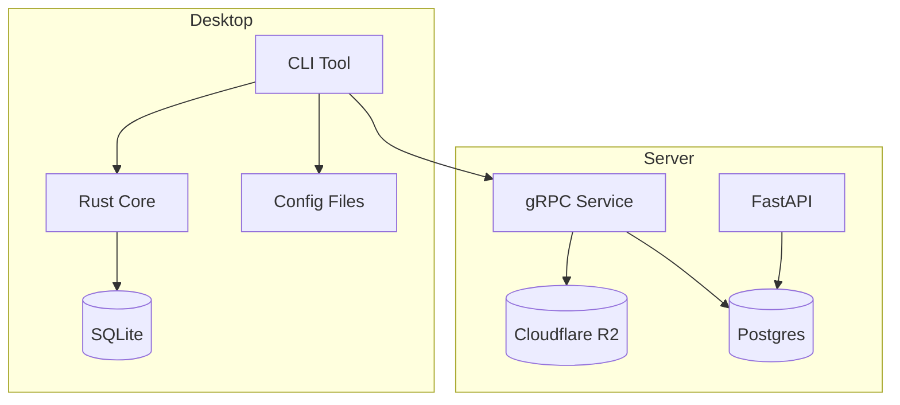
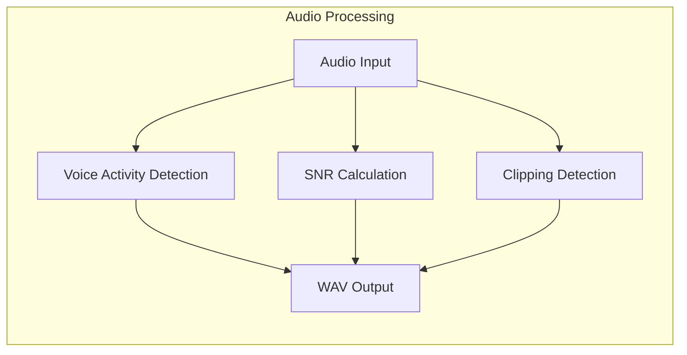
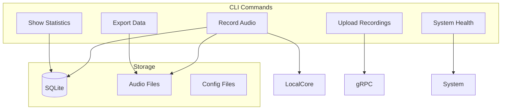
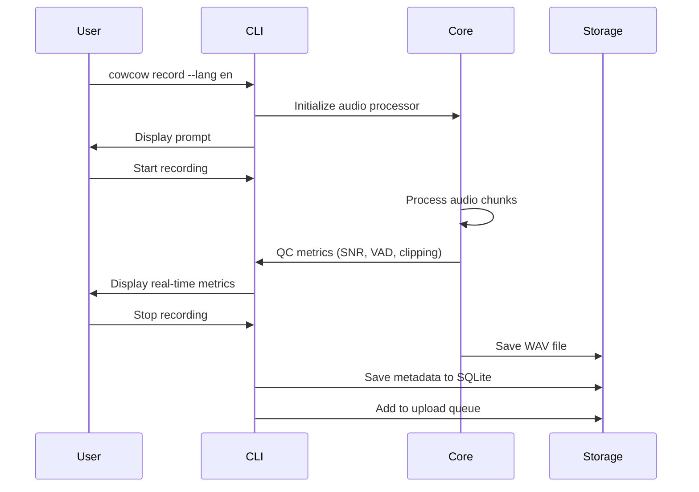
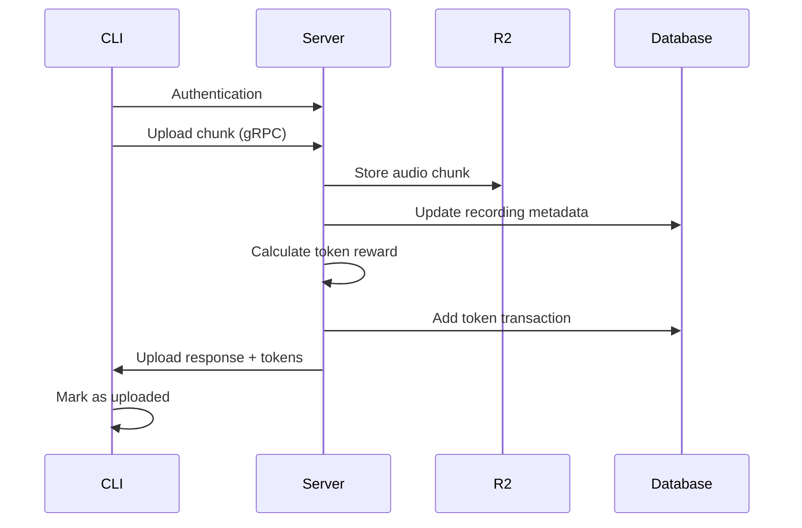
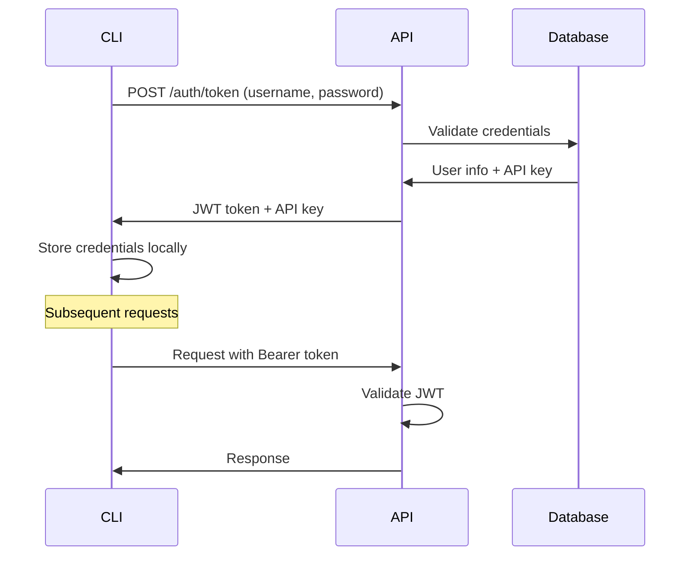

# Cowcow Architecture

## System Overview



## Component Details

### Core Library (`cowcow_core`)

The core library provides audio processing and quality control functionality:



Key features:
- Real-time audio processing
- Voice activity detection
- Signal-to-noise ratio calculation
- Clipping detection
- WAV file generation

### CLI Tool (`cowcow_cli`)

The command-line interface provides recording and management tools:



## Data Flow

### Recording Workflow



### Upload Workflow



## Storage Architecture

### Local Storage (CLI)

```
~/.cowcow/
├── config.toml          # Configuration
├── cowcow.db           # SQLite database
└── recordings/
    ├── en/             # Language directories
    │   ├── recording-1.wav
    │   └── recording-2.wav
    └── sw/
        └── recording-3.wav
```

### Database Schema

```sql
-- Local SQLite schema
CREATE TABLE recordings (
    id TEXT PRIMARY KEY,
    lang TEXT NOT NULL,
    prompt TEXT,
    qc_metrics JSON NOT NULL,
    created_at INTEGER NOT NULL,
    uploaded_at INTEGER,
    file_path TEXT NOT NULL
);

CREATE TABLE upload_queue (
    recording_id TEXT PRIMARY KEY,
    attempts INTEGER NOT NULL,
    last_attempt INTEGER,
    FOREIGN KEY (recording_id) REFERENCES recordings(id)
);

CREATE TABLE config (
    key TEXT PRIMARY KEY,
    value TEXT NOT NULL
);
```

### Remote Storage (Server)

```
Cloudflare R2:
cowcow-bucket/
├── en/
│   └── user-123/
│       ├── recording-1.wav
│       └── recording-2.wav
└── sw/
    └── user-456/
        └── recording-3.wav

PostgreSQL:
- users
- recordings
- tokens
- upload_sessions
```

## Security Model

### Authentication Flow



### Data Protection

- **Local**: SQLite database with file system permissions
- **Transit**: TLS 1.3 for all network communication
- **Remote**: Encrypted storage in R2, JWT authentication
- **API Keys**: Secure generation and storage

## Performance Considerations

### Audio Processing

- **Target**: < 200ms processing latency
- **Memory**: Streaming processing to minimize RAM usage
- **CPU**: Efficient algorithms for real-time QC
- **Storage**: Compressed WAV files (16kHz mono)

### Upload Strategy

- **Chunked**: Resume interrupted uploads
- **Compression**: Optional gzip compression
- **Batching**: Multiple recordings per upload session
- **Retry**: Exponential backoff for failed uploads

## Monitoring and Observability

### Logging

```rust
// Structured logging in Rust
tracing::info!(
    recording_id = %recording.id,
    duration = recording.duration,
    snr = recording.qc_metrics.snr_db,
    "Recording completed"
);
```

### Metrics

- Recording success/failure rates
- QC metric distributions
- Upload success rates
- Storage usage
- Token distribution

## Extensibility

### Plugin System

The core library supports extensible QC metrics:

```rust
pub trait QcMetric {
    fn name(&self) -> &str;
    fn calculate(&self, samples: &[f32]) -> f32;
    fn is_good(&self, value: f32) -> bool;
}
```

### Configuration

TOML-based configuration supports:
- Custom QC thresholds
- Upload strategies
- Storage locations
- Server endpoints 