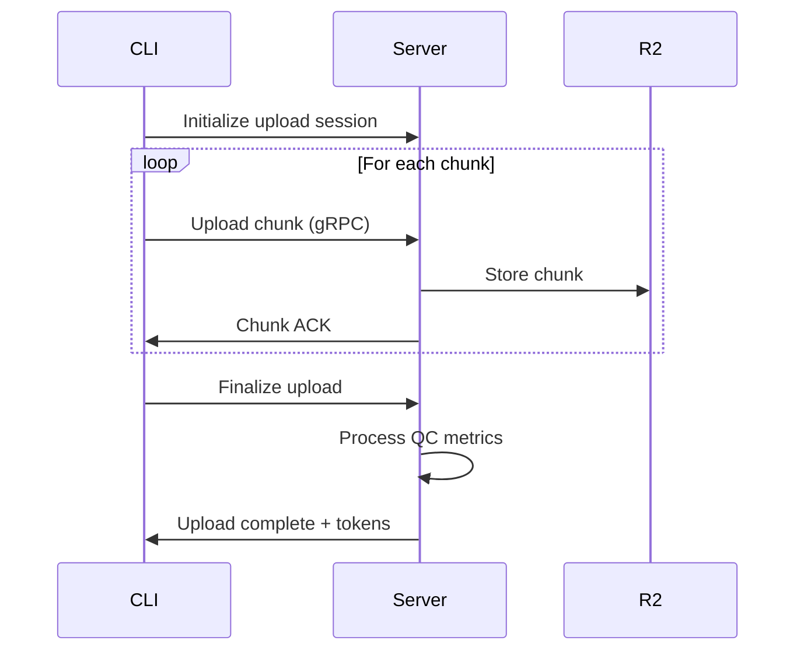

# Cowcow Low-Level Design

## Core Library (`cowcow_core`)

### Audio Processing Pipeline
```rust
pub struct AudioProcessor {
    sample_rate: u32,
    channels: u16,
    vad: WebRtcVad,
    buffer: Vec<f32>,
}

impl AudioProcessor {
    pub fn process_chunk(&mut self, samples: &[f32]) -> QcMetrics {
        // 1. Calculate RMS
        // 2. Detect clipping
        // 3. Run VAD
        // 4. Compute SNR
    }
}
```

### Public API
```rust
#[repr(C)]
pub struct QcMetrics {
    pub snr_db: f32,
    pub clipping_pct: f32,
    pub vad_ratio: f32,
}

pub fn analyze_wav(path: &str) -> Result<QcMetrics>;
```

## CLI (`cowcow_cli`)

### Command Structure
```rust
#[derive(Subcommand)]
enum Command {
    Record {
        #[arg(short, long)]
        lang: String,
        #[arg(short, long)]
        duration: Option<u32>,
        #[arg(short, long)]
        prompt: Option<String>,
    },
    Upload {
        #[arg(short, long)]
        force: bool,
    },
    Stats,
    Doctor,
    Export {
        #[arg(short, long)]
        format: String,
        #[arg(short, long)]
        dest: PathBuf,
    },
}
```

### Recording Flow
1. Initialize audio device
2. Start recording thread
3. Process chunks in real-time
4. Write WAV + JSON metadata
5. Queue for upload

### Configuration Management
```rust
#[derive(Deserialize)]
struct Config {
    api: ApiConfig,
    storage: StorageConfig,
    audio: AudioConfig,
}

#[derive(Deserialize)]
struct ApiConfig {
    endpoint: String,
    api_key: String,
}
```

### Database Schema
```sql
CREATE TABLE recordings (
    id TEXT PRIMARY KEY,
    lang TEXT NOT NULL,
    prompt TEXT,
    qc_metrics JSON NOT NULL,
    created_at INTEGER NOT NULL,
    uploaded_at INTEGER,
    file_path TEXT NOT NULL
);

CREATE TABLE upload_queue (
    recording_id TEXT PRIMARY KEY,
    attempts INTEGER NOT NULL,
    last_attempt INTEGER,
    FOREIGN KEY (recording_id) REFERENCES recordings(id)
);

CREATE TABLE config (
    key TEXT PRIMARY KEY,
    value TEXT NOT NULL
);
```

## Sync Service (`server`)

### API Endpoints
```python
@router.post("/auth/token")
async def login() -> Token:
    pass

@router.post("/recordings/upload")
async def upload_recording() -> UploadResponse:
    pass

@router.get("/recordings")
async def list_recordings() -> List[Recording]:
    pass

@router.get("/tokens/balance")
async def get_balance() -> Balance:
    pass
```

### gRPC Services
```protobuf
service UploadService {
    rpc UploadChunk(stream Chunk) returns (UploadResponse);
    rpc GetUploadStatus(UploadRequest) returns (UploadStatus);
}

service RewardService {
    rpc GetBalance(BalanceRequest) returns (BalanceResponse);
    rpc GetHistory(HistoryRequest) returns (stream Transaction);
}
```

### Database Models
```python
class User(Base):
    __tablename__ = 'users'
    id = Column(Integer, primary_key=True)
    username = Column(String(50), unique=True)
    email = Column(String(120), unique=True)
    api_key = Column(String(64), unique=True)

class Recording(Base):
    __tablename__ = 'recordings'
    id = Column(String, primary_key=True)
    user_id = Column(Integer, ForeignKey('users.id'))
    lang = Column(String(10))
    qc_metrics = Column(JSON)
    file_path = Column(String)
```

## Upload Protocol

### Chunked Upload Flow


### Retry Logic
```rust
async fn upload_with_retry(chunk: &[u8], max_retries: u32) -> Result<()> {
    for attempt in 0..max_retries {
        match upload_chunk(chunk).await {
            Ok(_) => return Ok(()),
            Err(e) if attempt < max_retries - 1 => {
                let delay = 2_u64.pow(attempt);
                tokio::time::sleep(Duration::from_secs(delay)).await;
            }
            Err(e) => return Err(e),
        }
    }
}
```

## Quality Control

### Real-time Processing
```rust
impl AudioProcessor {
    fn calculate_rms(&self, samples: &[f32]) -> f32 {
        let sum_squares: f32 = samples.iter().map(|&x| x * x).sum();
        (sum_squares / samples.len() as f32).sqrt()
    }
    
    fn detect_clipping(&self, samples: &[f32]) -> f32 {
        let clipped = samples.iter().filter(|&&x| x.abs() >= 1.0).count();
        (clipped as f32 / samples.len() as f32) * 100.0
    }
}
```

### Thresholds
```toml
[audio.qc]
min_snr_db = 20.0
max_clipping_pct = 1.0
min_vad_ratio = 80.0
```

## Error Handling

### CLI Error Types
```rust
#[derive(Error, Debug)]
pub enum CliError {
    #[error("Audio device not found")]
    AudioDeviceNotFound,
    #[error("Recording failed: {0}")]
    RecordingFailed(String),
    #[error("Upload failed: {0}")]
    UploadFailed(String),
    #[error("Database error: {0}")]
    DatabaseError(#[from] sqlx::Error),
}
```

### Server Error Responses
```python
class ErrorResponse(BaseModel):
    error: str
    message: str
    details: Optional[Dict] = None

@app.exception_handler(ValueError)
async def validation_error_handler(request, exc):
    return JSONResponse(
        status_code=400,
        content=ErrorResponse(
            error="validation_error",
            message=str(exc)
        ).dict()
    )
``` 